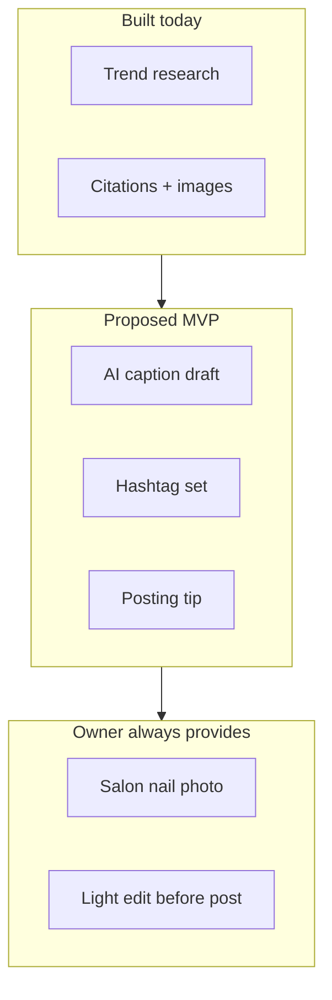

# Content Preference Summary

**Status:** Pending interviews — synthesize from section D and [content-preference-ranking.md](../interviews/questionnaires/content-preference-ranking.md).

## Purpose

Validate H5: AI-generated vs owner-generated content preferences by geography and post type.

## Preference options

| Code | Label |
|------|-------|
| A | AI draft, I edit |
| B | Templates only |
| C | I write myself |
| D | AI text + my photo |

## Aggregate by content type (fill)

| Content type | A | B | C | D | Top choice |
|--------------|---|---|---|---|------------|
| Caption text | | | | | |
| Hashtags | | | | | |
| Visuals | | | | | |
| Reel script | | | | | |

## By region

### Vietnam

| Content type | Top choice | Avg publish AI-assisted (1–5) |
|--------------|------------|-------------------------------|
| Captions | | |
| Hashtags | | |
| Visuals | | |

### Finland

| Content type | Top choice | Avg publish AI-assisted (1–5) |
|--------------|------------|-------------------------------|
| Captions | | |
| Hashtags | | |
| Visuals | | |

### International

| Content type | Top choice | Avg publish AI-assisted (1–5) |
|--------------|------------|-------------------------------|
| Captions | | |
| Hashtags | | |
| Visuals | | |

## Concept card scores (fill)

| Concept | Avg usefulness (1–5) | Avg would use (1–5) |
|---------|------------------------|---------------------|
| A — Caption draft | | |
| B — Hashtag set | | |
| C — Carousel outline | | |
| D — Image mood board | | |

## AI authenticity concerns (tally)

| Concern | VN | FI | INT | Total |
|---------|----|----|-----|-------|
| Client trust | | | | |
| Salon voice mismatch | | | | |
| Language quality (VI/FI) | | | | |
| Platform penalties | | | | |
| Competitors look bad with AI | | | | |
| Only own photos OK | | | | |
| No concerns | | | | |

## H5 validation

**Criterion:** Clear per-region pattern in caption vs visual preferences.

**H5 result:** _Pending_

## Proposed content model (pre-validation)

Based on desk research and concept design — validate in interviews:

**Hypothesis:** Owners accept AI for **text** (captions, hashtags) but require **owner photos** for visuals across all regions.

## MVP content scope recommendation (fill after M5)

| Feature | Build? | Priority | Evidence |
|---------|--------|----------|----------|
| Caption draft from trend | | | |
| Hashtag set | | | |
| Vietnamese captions | | | |
| Carousel outline | | | |
| AI mood boards | | | |
| Reel scripts | | | |

## Mock post reaction

Track reactions to [mock-social-post.json](../../../samples/market-validation/mock-social-post.json):

| Code | Would publish? | Changes needed | VI caption useful? |
|------|----------------|----------------|-------------------|
| | | | |
