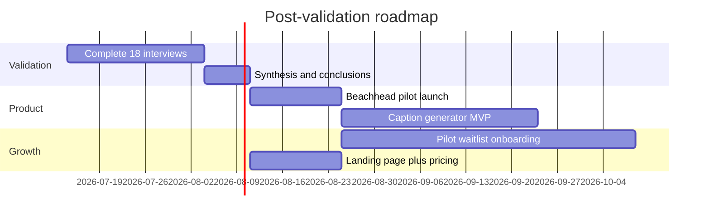

# Next Steps

**Status:** Draft roadmap — finalize after [conclusions.md](conclusions.md) interview data.

## 90-day roadmap (proposed)

## Immediate actions (week 7+)

| # | Action | Owner | Due |
|---|--------|-------|-----|
| 1 | Complete remaining interviews per [execution-kit.md](../interviews/execution-kit.md) | | |
| 2 | Fill outcome docs in `outcomes/` | | |
| 3 | Finalize beachhead in [conclusions.md](conclusions.md) | | |
| 4 | Update [specs/nails-trending.md](../../../specs/nails-trending.md) with validated use cases | | |
| 5 | Launch 30-day pilot with waitlist (≥5 owners stretch goal) | | |

## Product priorities (pre-validation proposal)

Order based on desk research; re-rank after pain-point and content-preference synthesis:

| Priority | Feature | Rationale | Depends on |
|----------|---------|-----------|------------|
| P0 | Weekly trend digest (neutral + personalized) | Core value; already built | — |
| P1 | Trend → caption + hashtag draft | Likely top pain (P4 captions) | Interview validation |
| P2 | Vietnamese caption localization | VN beachhead candidate | H5 + regional fit |
| P3 | Email/push weekly digest | Consistency pain (P3) | P0 |
| P4 | Carousel outline | If FI/INT demand | P1 |
| P5 | Scheduling integration | Later/Buffer — not core differentiator | — |
| Defer | AI mood board images | Authenticity risk | H5 |

## Beachhead strategy (hypothesis)

| Scenario | If interviews show… | Action |
|----------|----------------------|--------|
| **VN wins** | High pain + pilot intent + VND WTP | Vietnamese UI/captions first; FB+IG focus |
| **FI wins** | Highest WTP + strong demo reaction | EUR pricing; Finnish optional |
| **INT wins** | Broadest WTP band + scale | English default; US/UK outreach |
| **Multi-market** | Similar signals | Launch EN + VI; FI as secondary |

**Current hypothesis:** Vietnam for pilot volume; validate WTP vs Finland in interviews.

## Pilot offer (draft)

| Element | Detail |
|---------|--------|
| Duration | 30 days free |
| Includes | Weekly personalized trend reports + caption drafts (when built) |
| Cohort size | 10–15 owners (mix from waitlist) |
| Success metric | ≥70% active weekly; ≥50% use caption draft; NPS ≥30 |
| Conversion | Pro tier at regional pricing from [pricing-summary.md](pricing-summary.md) |

## Landing page (optional M5.4)

Draft copy points:

- **Headline:** Stay on trend. Post in minutes.
- **Sub:** Weekly nail trends and ready-to-edit captions for busy salon owners.
- **CTA:** Join the free pilot
- **Social proof:** _Add after pilot_

Save one-pager to `outcomes/pilot-landing-copy.md` when ready.

## Research program closure

| Milestone | Done when |
|-----------|-----------|
| M2 Recruitment | 18 scheduled |
| M3 Interviews | 18 videos + summaries |
| M4 Synthesis | All outcome docs filled |
| M5 Recommendations | Conclusions + spec update + pilot plan |

## Links

- [Program README](../README.md)
- [Recruitment playbook](../specs/recruitment-playbook.md)
- [Hypotheses](../specs/hypotheses.md)
