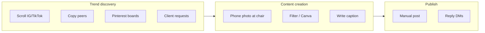

# Pain Point Severity

**Status:** Pending interviews — rank after M4 synthesis.

## Purpose

Quantify and rank pain points for nail salon owners maintaining social profiles. Validates H1 and informs MVP priority.

## Pain categories

| ID | Pain | Interview probe |
|----|------|-----------------|
| P1 | **Time** — no hours left after clients | Q7, Q8 |
| P2 | **Inspiration** — don't know what's trending | Q5, Q6, Q8 |
| P3 | **Consistency** — post in bursts then go quiet | Q4, Q11 |
| P4 | **Captions/copy** — hard to write engaging text | Q8, section D |
| P5 | **Design skill** — not a graphic designer | Q9, tools question |
| P6 | **Language** — natural Vietnamese/Finnish copy | Section D Q19 |
| P7 | **Algorithm/reach** — falling behind hurts visibility | Q11 |
| P8 | **Competitor pressure** — other salons look more active | Q4, Q11 |

## Severity matrix (fill per interview)

| Code | P1 | P2 | P3 | P4 | P5 | P6 | P7 | P8 | Top pain |
|------|----|----|----|----|----|----|----|----|----------|
| VN-01 | | | | | | | | | |
| ... | | | | | | | | | |

_Rate 1–5 based on post-interview form and transcript._

## Aggregate ranking (fill after n≥18)

| Rank | Pain | Avg severity | % citing unprompted | VN | FI | INT |
|------|------|--------------|---------------------|----|----|-----|
| 1 | | | | | | |
| 2 | | | | | | |
| 3 | | | | | | |
| 4 | | | | | | |
| 5 | | | | | | |

## H1 validation

**Criterion:** ≥70% rate overall "staying on-trend" pain as 4 or 5.

| Region | n | Pain ≥4 | % |
|--------|---|---------|---|
| VN | | | |
| FI | | | |
| INT | | | |
| **All** | | | |

**H1 result:** _Pending_

## Consequences of falling behind (qualitative themes)

_Collect quotes about bookings, DMs, morale, competitor pressure._

| Theme | # mentions | Example quote |
|-------|------------|---------------|
| Fewer bookings | | |
| Less DM inquiries | | |
| Stress / guilt | | |
| Competitors win | | |
| No noticeable impact | | |

## Product implications

| If top pain is… | MVP priority |
|-----------------|--------------|
| P2 Inspiration | Trend digest (already built) |
| P4 Captions | Caption generator from trend |
| P3 Consistency | Weekly email/push digest |
| P6 Language | Localized caption generation |
| P1 Time | One-click trend → post workflow |

## Current-state workflow (proposed diagram)

Validate and refine per region in interviews:

_Regional variants: VN may add Facebook + Zalo; FI may emphasize Reels._
