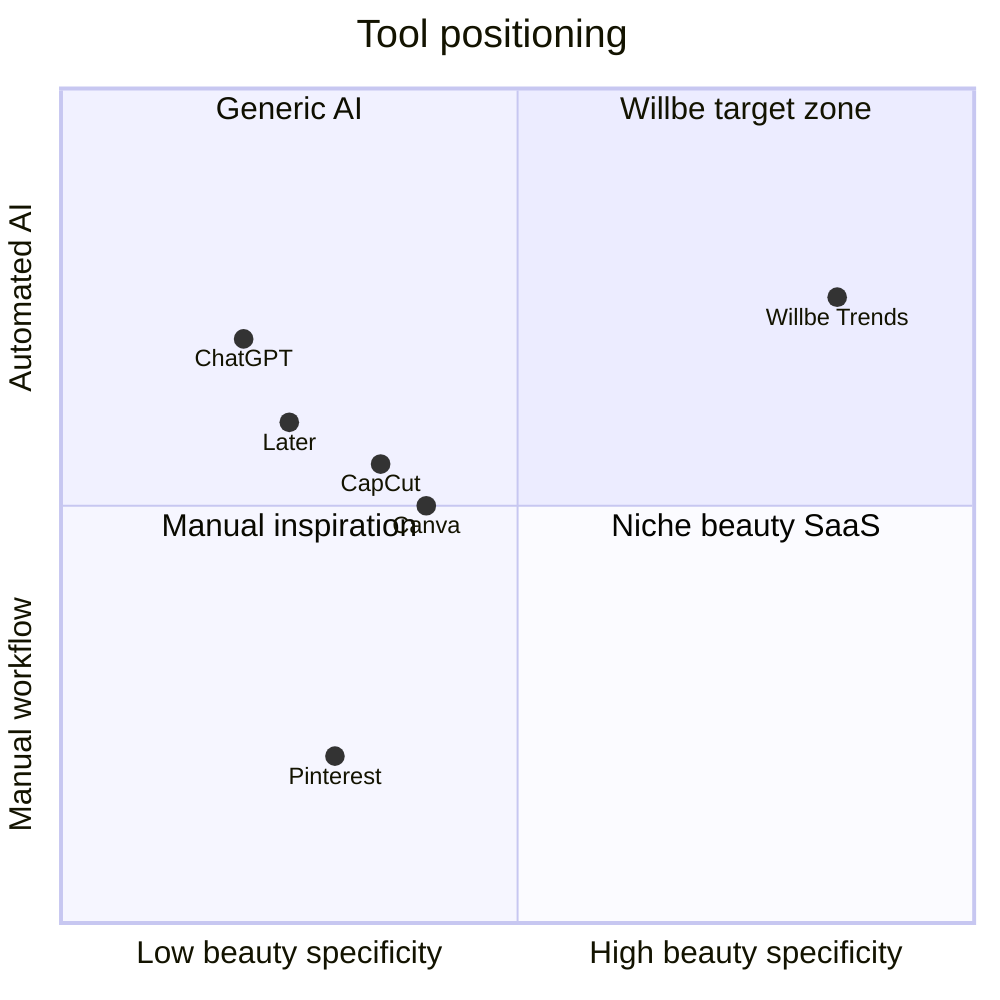

# Competitor & Substitute Landscape

Desk research for nail salon social media and trend discovery. Updated 2026-07-09.

## Category map

## Direct & adjacent competitors

| Product | What it does | Beauty/nail focus | Trend research | Content generation | Gap vs Willbe |
|---------|--------------|-------------------|----------------|-------------------|---------------|
| **Canva** | Templates, design, Magic Write | Low (generic templates) | No structured trends | Captions, graphics | No nail-specific trend pipeline or citations |
| **CapCut** | Video editing, auto captions | Low | No | Reels templates | No trend intelligence |
| **Later / Buffer / Hootsuite** | Scheduling, analytics | Low | No | Limited AI captions (add-ons) | Scheduling without domain research |
| **ChatGPT / Claude** | General AI assistant | None native | Ad-hoc if prompted | Captions if prompted | No web-backed nail trends, no salon workflow, inconsistent |
| **Pinterest** | Visual discovery | Medium (nail boards) | Passive inspiration | None | No personalization, no post-ready output |
| **Instagram/TikTok** | Platform + algorithm | High (content itself) | Implicit via feed | None | Time-consuming; no curation for business |
| **Nail educators (IG/YT)** | Courses, trend posts | High | Human-curated | None | Not personalized; not scalable SaaS |
| **Salon booking apps** (Fresha, etc.) | Bookings, reminders | Medium | Rarely | Some marketing add-ons | Not core competency |

## Substitutes (what owners do today)

1. **Scroll and save** — IG/TikTok explore, save to collections
2. **Copy peers** — Repost or adapt designs from nearby salons
3. **Client-led** — "Can you do this?" from client screenshots
4. **Supplier catalogs** — OPI, Gelish seasonal collections
5. **Courses & workshops** — Pay for trend education from nail brands
6. **Do nothing** — Post only finished client work without trend framing

## Regional notes

### Vietnam

- **Zalo** and **Facebook** often outperform Instagram for local salon discovery
- Price-sensitive; freemium or low monthly tiers expected
- Vietnamese-language content is important for captions and UI
- Strong nail communities on Facebook groups (HCMC, Hanoi)

### Finland

- **Instagram** primary for nail artists; TikTok growing
- Higher tolerance for SaaS pricing in EUR
- English acceptable for many; Finnish localization a plus
- Smaller market — harder recruitment, potentially higher WTP

### International

- US/UK/AU: Instagram + TikTok dominant; Later/Canva common
- "Clean girl," chrome, and seasonal micro-trends cycle fast
- More competition from generic social tools

## Willbe differentiation (hypothesis)

| Capability | Willbe | Nearest alternative |
|------------|--------|---------------------|
| Web-backed nail trend reports with citations | Yes | Manual Pinterest + ChatGPT |
| Personalized trends from salon style prefs | Yes | None structured |
| Reference images per trend | Yes | Image search manually |
| Trend → caption + hashtags (proposed) | Planned | Canva Magic Write (generic) |
| Region-aware research | Yes | None |

## Questions to validate in interviews

- Which tools do they already pay for?
- Would they replace an existing tool or add Willbe on top?
- Is "trend research" a recognized job-to-be-done, or do they frame it as "finding inspiration"?
- Do citations and source links matter for trust?

## Sources

- Product websites: Canva, Later, CapCut, Fresha (2026)
- Observed nail salon social behavior on Instagram/TikTok
- Internal product capabilities per [specs/nails-trending.md](../../../specs/nails-trending.md)
