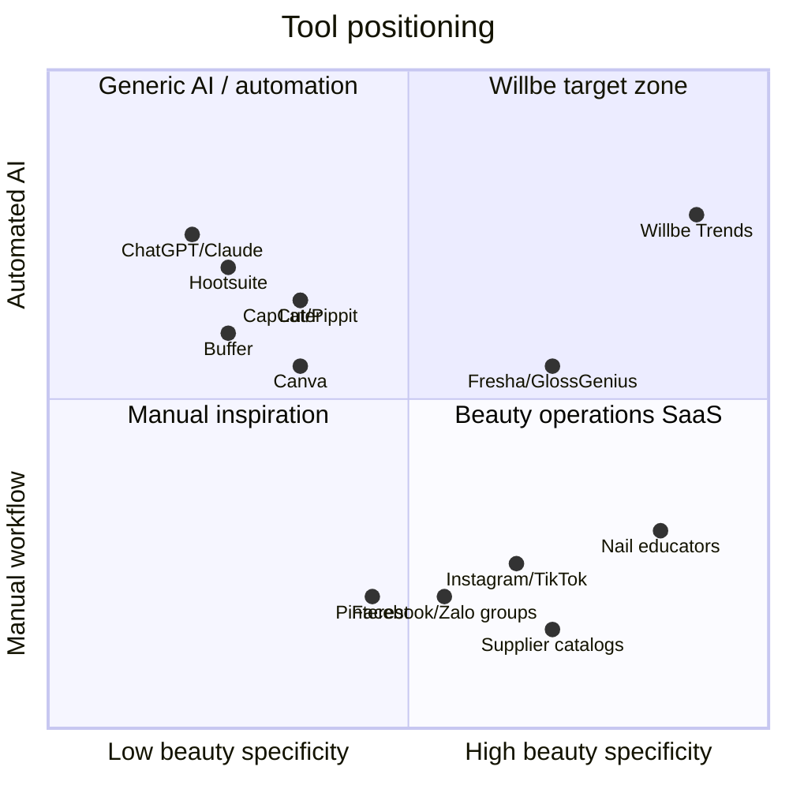

# Competitor & Substitute Landscape

Desk research for nail salon / spa owner social media, trend discovery, and AI-assisted content workflows. Updated 2026-07-10.

> M1.2 status: complete as desk research. Treat findings as working hypotheses until validated in interviews and M4 synthesis.

## Research goal

Understand what currently competes with Willbe for a salon owner's time, attention, and monthly software budget when they need to:

1. notice relevant nail / beauty trends,
2. decide which ideas fit their salon style and region,
3. turn those ideas into social posts,
4. publish consistently without spending too much owner time.

## Executive takeaways

- The market is not empty, but the strongest substitutes are **manual and social-first**, not dedicated trend-research SaaS.
- Most owners are likely to frame the job as **finding inspiration**, **looking for ideas**, or **checking what is trending**, not formally as "trend research".
- Canva, CapCut, ChatGPT/Claude, Pinterest, Instagram/TikTok, and schedulers solve pieces of the workflow, but none clearly combine **nail/spa-specific trend discovery + regional relevance + source links + ready-to-edit captions/hashtags**.
- Later and Hootsuite are the closest paid adjacent competitors on trend-aware social management; however, their trend features are broad social-media management features rather than beauty/nail-specific workflow support.
- Booking/CRM platforms such as Fresha, GlossGenius, Square Appointments, and similar salon tools may compete for budget, but their core job is appointments, payments, client communication, and retention marketing rather than trend intelligence.
- Willbe should avoid positioning only as an "AI caption generator". That category is crowded and low-differentiation. Stronger positioning is: **region-aware nail/spa trend briefing that gives owners usable post ideas with references, captions, hashtags, and an owner-in-the-loop workflow**.

## Category map

Interpretation:

- **Manual inspiration:** owners scroll, save, copy, and adapt from social feeds, peers, clients, and supplier visuals.
- **Generic AI / automation:** tools help write, design, edit, schedule, or analyze content, but the user must bring the trend context.
- **Beauty operations SaaS:** tools are closer to the industry but mainly support booking, payments, client data, reminders, campaigns, and operations.
- **Willbe target zone:** beauty/nail-specific trend intelligence with AI-assisted content output and regional relevance.

## Direct and adjacent competitors

| Product / category | What it does | Paid baseline / budget signal | Beauty / nail focus | Trend research | Content generation | Displacement risk | Gap vs Willbe / test angle |
|---|---|---:|---|---|---|---|---|
| **Canva / Magic Studio** | Templates, brand kits, graphics, short-form assets, AI writing/design features | Paid design budget; pricing varies by region and seat | Low; generic templates with some beauty assets | No structured nail trend pipeline | Graphics, copy, AI design support | Medium: owners may already pay for it | Strong design execution, weak trend discovery. Test whether Willbe complements Canva by supplying ideas/captions that can be designed in Canva. |
| **CapCut** | Mobile/web video editing, templates, auto captions, AI video tools | Freemium / Pro budget | Low; creator-first, not salon-specific | No structured nail trend research | Video editing, AI video, auto captions, templates | Medium for Reels/TikTok workflow | Great for editing after the owner has an idea. Does not decide which nail/spa trends to post. |
| **Pippit AI / CapCut for Business** | AI creative agent for marketing videos, avatars, product/social content, publishing tools | Emerging AI creative budget | Low to medium; marketing/e-commerce oriented | Can reference social trends broadly | AI video/images/social assets | Medium if owner wants marketing video automation | More automated creative production, but not nail/spa trend curation or local salon workflow. |
| **Later** | Social scheduling, link in bio, analytics, AI captions/ideas, approvals, future insights on high tiers | Starter and Growth price points overlap SMB SaaS budgets | Low; social-media manager tool | Some broad future/trend insight features, especially higher tiers | AI caption/idea credits | High for teams already scheduling content | Closest adjacent competitor. Test if owners need scheduling/analytics or if the pain starts earlier: "what should I post this week?" |
| **Buffer** | Simple scheduling, ideas library, AI assistant, analytics, hashtag manager | Low per-channel pricing is SMB-friendly | Low | No nail-specific trend research | AI assistant, ideas, scheduling | Medium: affordable and simple | Strong publish workflow, weak domain-specific inspiration. Test if Willbe should integrate/export to Buffer later. |
| **Hootsuite** | Enterprise-grade social management, analytics, listening, trend forecasting, AI generators | Higher monthly pricing; likely too expensive for solo/small salons | Low | Broad social trend forecasting/listening | AI captions/generators, reports | Low to medium for small salons; higher for agencies/multi-location | Useful benchmark for trend forecasting, but likely overbuilt/expensive for the target ICP. |
| **ChatGPT / Claude** | General AI assistants for brainstorming, captions, translation, planning | Individual AI subscription budget | None by default | Ad-hoc only if prompted and web-enabled | Strong text generation | High if owners are AI-comfortable | Cheap and flexible, but inconsistent, not workflow-specific, and requires prompt skill. Test whether owners want a guided product instead of prompting. |
| **Pinterest** | Visual inspiration, boards, search, trend discovery | Mostly time cost; ads/business optional | Medium; strong visual nail content | Passive inspiration, not salon-specific analysis | None natively for post output | High as a substitute | Excellent inspiration source. Weakness: no personalization, prioritization, captions, or local business framing. |
| **Instagram / TikTok** | Where nail/spa trends are discovered, copied, and validated by engagement | Time cost; ads optional | High because content is native | Implicit via feed/algorithm | None natively for post-ready planning | Very high as daily habit | Primary substitute. Test whether owners feel scrolling is enjoyable, addictive, or inefficient. |
| **Facebook / Zalo groups** | Local community, peer examples, salon/client communication in Vietnam | Low software cost; high attention cost | Medium to high in VN | Informal, community-driven | None | High in VN | Strong local discovery and customer communication, but unstructured and not post-ready. |
| **Nail educators / influencers / brand courses** | Human-curated trend education, tutorials, technique demos | Workshop/course budget | High | Human-curated | No automated post output | Medium for education-driven owners | High trust and specificity; weak scalability/personalization. Test whether owners trust people more than AI trend reports. |
| **Supplier catalogs** (OPI, Gelish, etc.) | Seasonal collections, product-driven color stories | Product purchase budget | High for nail colors/products | Brand-led seasonal inspiration | None | Medium | Useful trend input but biased toward supplier inventory. Test whether supplier-led trends are enough. |
| **Salon booking / CRM tools** (Fresha, GlossGenius, Square Appointments, etc.) | Booking, reminders, payments, client management, marketing messages | Core operations software budget | Medium to high | Rare / not core | Some email/SMS marketing and campaign tools | Budget competition more than workflow competition | Competes for monthly SaaS spend, not the same job. Test whether owners want content creation inside operations software or separate. |
| **Freelancers / agencies / social media managers** | Done-for-you content planning, posting, ads, design | Higher monthly services budget | Variable | Human-curated | Yes | High for salons already outsourcing | Strongest full-service substitute, but expensive and less productized. Test whether Willbe is a cheaper assistive layer or replacement. |
| **Do nothing / post client work only** | Owner posts finished sets when available | No cash cost; inconsistent growth | High authenticity | None | Owner-written captions only | Very high baseline behavior | The real competitor may be inertia. Test if content freshness is important enough to change behavior. |

## Substitute workflows observed / assumed

These are the practical ways owners may currently solve the problem without a dedicated product.

### 1. Scroll-and-save workflow

1. Owner scrolls Instagram, TikTok, Pinterest, Facebook, or Zalo groups.
2. Saves screenshots/posts into camera roll, collections, chat, or notes.
3. Uses saved images as reference for client conversations or future posts.
4. Posts only when there is a finished client photo or when inspiration feels obvious.

**Risk for Willbe:** If owners enjoy scrolling and do not value time savings, Willbe may be seen as unnecessary.

**Interview probe:** "Walk me through the last nail/spa trend or service you decided to promote. Where did the idea come from?"

### 2. Copy-and-adapt peer workflow

1. Owner checks nearby salons, competitors, or popular artists.
2. Reposts, recreates, or slightly adapts a design/content style.
3. Captions are written quickly or copied from common patterns.

**Risk for Willbe:** Owners may prefer proven local examples over global trend reports.

**Interview probe:** "Do you ever look at other salons before posting? How do you decide what is okay to copy or adapt?"

### 3. Client-led workflow

1. Client sends a screenshot of a design or treatment result.
2. Salon performs the service.
3. Owner photographs the result and posts it if the result looks good.

**Risk for Willbe:** Trend discovery may be pulled by clients, not actively owned by the salon.

**Interview probe:** "How often do clients bring you the trend instead of you promoting it first?"

### 4. Supplier / product-led workflow

1. Supplier launches a seasonal color/product collection.
2. Salon buys or tests the collection.
3. Posts are built around the available product, promotion, or service.

**Risk for Willbe:** Supplier content may be enough for owners who depend heavily on product catalogs.

**Interview probe:** "Do brands or suppliers give you enough seasonal content ideas?"

### 5. Education-led workflow

1. Owner follows nail educators, YouTube creators, workshops, or brand trainers.
2. Learns new techniques/designs.
3. Posts once they can execute the design confidently.

**Risk for Willbe:** Trend interest may be tied to technical confidence, not just inspiration.

**Interview probe:** "When you see a trend, what makes you decide whether your salon can actually offer it?"

### 6. Inertia / authenticity-first workflow

1. Owner posts only real client work.
2. Little planning, few trend captions, inconsistent frequency.
3. Content is authentic but reactive and irregular.

**Risk for Willbe:** If social is not linked to bookings in the owner's mind, willingness to pay will be weak.

**Interview probe:** "What happens if you do not post for two weeks? Does it affect bookings?"

## Regional notes to validate

### Vietnam

Working assumptions:

- Facebook, Zalo, TikTok, and local groups may matter more than Instagram for many neighborhood salons.
- Vietnamese captions are likely a requirement, not a nice-to-have, if Vietnam becomes the beachhead.
- Price sensitivity is likely high; freemium, low monthly tiers, or pay-per-report may test better than premium SaaS pricing.
- Trust may come from local examples, Vietnamese language, clear source links, and reference images.

Interview implications:

- Ask explicitly which platform brings bookings: Facebook page, Zalo, TikTok, Instagram, Google, word-of-mouth.
- Test if source links matter, or if owners simply want usable Vietnamese captions.
- Test whether owners would pay for weekly reports if they already rely on Facebook groups and client screenshots.

### Finland

Working assumptions:

- Instagram is likely important for nail artists and beauty creators; TikTok may be growing but not always the main conversion channel.
- Higher tolerance for EUR SaaS pricing than Vietnam, but the market is smaller and recruitment may be harder.
- English may be acceptable for research/demo, while Finnish localization may improve adoption.
- Owners may be more privacy/quality conscious about AI-generated images.

Interview implications:

- Separate solo artists from salons with employees.
- Ask whether English captions are publishable, draft-only, or unacceptable.
- Probe WTP carefully because small sample sizes may distort conclusions.

### International / English-speaking markets

Working assumptions:

- Instagram and TikTok dominate discovery; Pinterest remains strong for visual inspiration.
- Generic social tools and AI tools are more common, so differentiation must be sharper.
- Owners may already use Canva, CapCut, ChatGPT, Later, Buffer, or freelancers.
- Seasonal and micro-trends move quickly, increasing need for faster research cycles.

Interview implications:

- Ask what paid tools are already in the stack.
- Test whether Willbe replaces ChatGPT/Canva/Later or sits before them as the trend-intelligence layer.
- Ask if citation-backed reports feel professional or unnecessary.

## Willbe differentiation to validate

| Capability | Willbe hypothesis | Nearest alternative | Validation question |
|---|---|---|---|
| Web-backed nail/spa trend reports with citations | Owners trust and act faster when trend suggestions include sources | Manual Pinterest/TikTok search + ChatGPT | Do source links make the report more trustworthy or too complicated? |
| Personalized trends from salon style preferences | Owners want ideas filtered by their own style, services, colors, and region | Manual saved boards | Would personalization change what they post this week? |
| Reference images per trend | Owners need visual proof before deciding whether a trend fits | Pinterest/Instagram saves | Are reference images required for trust and execution? |
| Trend to caption + hashtags | Ready-to-edit captions save time and increase posting frequency | ChatGPT, Canva, Later, Buffer | Would this save at least 2 hours/week or increase posting frequency? |
| Region-aware research | Local/regional relevance improves usefulness | Social feeds and local groups | Are global trends too generic, or do they still inspire local posts? |
| Owner-in-the-loop publishing | Owners want AI assistance but not fully automated posting | Manual posting / schedulers | Which steps must remain owner-approved before publishing? |

## Interview questions to add to guides

Use these questions in Section B/E or as probes when testing H2, H3, H4, and H5.

### Tool stack and spend

1. Which tools do you currently use for content creation or posting? Examples: Canva, CapCut, ChatGPT, Pinterest, Instagram, TikTok, Facebook, Zalo, Later, Buffer, Hootsuite, booking software, freelancers.
2. Which of those do you pay for monthly?
3. What is the one tool you would not want to lose?
4. If Willbe worked well, would it replace any current tool or be added on top?

### Current substitute workflow

1. Walk me through the last time you chose a design, service, or trend to promote.
2. Where did the idea come from?
3. How did you decide it was worth posting?
4. Who wrote the caption and chose hashtags?
5. How long did the whole process take from idea to post?
6. What part was most annoying: finding ideas, choosing what fits, writing captions, editing visuals, or posting consistently?

### Trust and source links

1. If a trend report includes links to TikTok/Instagram/Pinterest/examples, does that make you trust it more?
2. Do you want to see reference images before using a trend idea?
3. Would you trust AI suggestions more if they showed where the trend came from?
4. Are citations useful, or do they make the report feel too complicated?

### AI comfort by content type

Ask the owner to rate comfort from 1 to 5 for publishing each AI-assisted output:

- Caption draft
- Hashtags
- Trend summary
- Post idea
- Image reference / mood board
- Fully AI-generated nail image
- Auto-scheduled post

Probe: "Which parts must you personally approve before posting?"

### Pricing and replacement logic

1. Would this feel like a content tool, a marketing assistant, or a trend/inspiration tool?
2. Would you expect it to be cheaper than Canva/CapCut, similar to them, or more expensive because it is specialized?
3. If it saved 2 hours per week, what monthly price would feel reasonable?
4. Would you prefer monthly subscription, pay-per-report, or included in a larger salon software package?

## Coding tags for interview synthesis

Use these tags when reviewing notes/transcripts:

| Tag | Meaning |
|---|---|
| `tool_paid` | Owner currently pays for at least one content/social tool |
| `tool_free_only` | Owner uses only free/manual tools |
| `source_ig_tiktok` | Trend source is Instagram/TikTok feed |
| `source_pinterest` | Trend source is Pinterest |
| `source_fb_zalo` | Trend source is Facebook/Zalo/community group |
| `source_client` | Client screenshots drive trend discovery |
| `source_supplier` | Supplier catalogs/brands drive trend discovery |
| `workflow_informal` | No structured process; mostly scrolling/saving |
| `workflow_structured` | Has calendar, planned campaigns, or assigned roles |
| `trust_sources_yes` | Source links/citations increase trust |
| `trust_sources_no` | Source links/citations do not matter |
| `ai_caption_ok` | AI captions acceptable with editing |
| `ai_image_resistance` | Owner resists publishing AI-generated images |
| `replace_tool` | Willbe could replace an existing tool/service |
| `add_on_tool` | Willbe would be added on top of current stack |
| `inertia_risk` | Owner agrees idea is useful but unlikely to change behavior |

## Implications for hypotheses

| Hypothesis | How M1.2 informs the test |
|---|---|
| H1 — Social content freshness is a real pain | Competitors/substitutes show many manual workarounds; interviews must prove this is painful, not just normal behavior. |
| H2 — Trend briefing + post ideas improve workflow | Compare Willbe against the actual substitute: scrolling + screenshots + quick captions, not against a perfect SaaS workflow. |
| H3 — Trend discovery is informal, not tool-driven | Validate whether owners use IG/TikTok/Pinterest/Facebook/Zalo/peers more than structured tools or agencies. |
| H4 — Willingness to pay exists | Benchmark against existing paid tools: low-cost schedulers, Canva/CapCut, AI assistants, booking software, freelancers. |
| H5 — AI vs UGC varies by geography and post type | Competitor landscape suggests AI text is more accepted than AI imagery; verify by region and content type. |

## Open risks / unknowns

- Whether "trend research" is a phrase owners understand or whether the product should say "weekly ideas" / "inspiration" instead.
- Whether source links increase trust or create cognitive load.
- Whether owners want publishing/scheduling or only idea/caption support.
- Whether Willbe should integrate with Canva/CapCut/Buffer later rather than compete with them.
- Whether booking/CRM tools will add enough AI marketing features to reduce need for a separate product.
- Whether local examples matter more than global trend signals in Vietnam and Finland.

## Sources checked

Accessed 2026-07-10.

- Buffer pricing and feature comparison: https://buffer.com/pricing
- Later pricing, AI credits, Future Insights, scheduling/analytics: https://later.com/pricing/
- Hootsuite plans and pricing FAQ, trend forecasting mention: https://www.hootsuite.com/plans
- Claude pricing and plan feature comparison: https://www.anthropic.com/pricing
- ChatGPT pricing and plan feature comparison: https://openai.com/chatgpt/pricing/
- CapCut AI video generator / AI tools: https://www.capcut.com/tools/ai-video-generator
- Pippit AI / CapCut for Business: https://www.capcut.com/business
- Canva pricing and Magic Write pages checked; content was partially blocked by unsupported-browser rendering. Use this as a known source limitation and re-check manually in browser before final pricing analysis.
- Fresha business/pricing pages checked; content was partially unavailable through automated fetch. Re-check manually before final pricing analysis.
- GlossGenius public profile and feature summaries checked as adjacent beauty operations software.
- Internal product capability reference: `specs/nails-trending.md`

## M1.2 output checklist

- [x] Competitor category map created
- [x] Direct and adjacent competitors listed
- [x] Current substitute workflows documented
- [x] Regional assumptions for VN / FI / international added
- [x] Willbe differentiation hypotheses defined
- [x] Interview questions added for validation
- [x] Synthesis coding tags added
- [x] Source limitations noted
