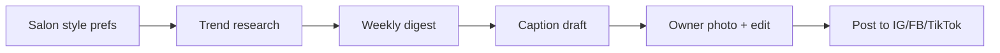

# Nails Trending Research Spec

## Goal

Deliver two complementary trend experiences for the nails vertical:

1. **Neutral trending** — objective, category-wide signals anyone can browse
2. **Personalized trending** — "You may like it" picks shaped by explicit user inputs

Both modes use the same underlying trend schema but different prompts and ranking logic.

## Web research

- Enabled by default (`WILLBE_WEB_SEARCH_ENABLED=true`)
- Search providers: `duckduckgo` (default), `tavily` (requires `TAVILY_API_KEY`)
- Preferred sources: `config/preferred_sources.yaml` — list is empty for now; add domains later to boost ranking and trigger `site:` queries
- Reports include `web_research` with queries, citations, and preferred-source flags
- Each trend includes a reference `image_url` from image search (DuckDuckGo by default)
- Disable images via `WILLBE_IMAGE_SEARCH_ENABLED=false`
- Disable via `--no-web-search` or `WILLBE_WEB_SEARCH_ENABLED=false`

## Modes

### Neutral trending

- Input: category (`nails`), optional region
- Output: 5–8 trends with popularity, colors, techniques, tags, confidence
- Tone: editorial, unbiased, no brand mentions
- Use case: homepage feed, editorial roundup, salon inspiration board

### Personalized trending

- Required inputs (v1):
  - `favorite_colors`
  - `preferred_shapes`
  - `preferred_finishes`
  - `style_keywords`
- Optional inputs:
  - `avoided_colors`
  - `preferred_lengths`
  - `occasion`
  - `budget`
  - `notes`
- Output: 4–6 tailored trends with fit rationale in summary and descriptions
- Use case: logged-in user home, post-quiz recommendations, push/email digest

## LLM requirements

- Provider must be switchable at runtime via env (`WILLBE_LLM_PROVIDER`) or CLI (`--provider`)
- Supported providers (v1): `openai`, `anthropic`, `ollama`
- Responses must be structured JSON validated against `TrendReport` / `TrendSignal`

## Data model

See `src/willbe_trends/models/trends.py` and `preferences.py`.

## CLI (v1)

```bash
willbe-trends neutral nails
willbe-trends neutral nails --no-web-search
willbe-trends neutral nails --sources config/preferred_sources.yaml
willbe-trends personalized nails --preferences samples/user_preferences.json
willbe-trends search-providers
willbe-trends providers
willbe-trends validate-preferences samples/user_preferences.json
```

## Trend briefs (v0.2)

Generate a ranked **trend brief** from a saved research report, then **content ideas** per trend.

### API

| Method | Path | Description |
|--------|------|-------------|
| POST | `/api/briefs/generate` | Body: `{ "report_id", "trend_name", "platform": "instagram" \| "tiktok" }` |
| GET | `/api/briefs/latest` | Latest brief for the current user context |
| GET | `/api/briefs/{id}` | Brief with ranked items, evidence, why-now |
| POST | `/api/ideas/generate` | Body: `{ "brief_item_id", "platform", "post_format" }` — add another post option to an existing brief item |

Models: `src/willbe_trends/models/briefs.py`. Service: `src/willbe_trends/briefs/service.py`.

### Web UI

From a report (`/reports/:id`), pick a trend → **Create post** → `/briefs/generate/:reportId/:trendName` → `/briefs/:id`. Add more options from the post page (platform picker + generate). Legacy `/ideas/:briefItemId` URLs redirect to the brief.

## Future extensions

- Deeper social workflows (scheduling, carousel design) — see [market validation pilot](../projects/spa-market-validation/outcomes/next-steps.md)
- Populate `config/preferred_sources.yaml` with editorial and social sources
- Web UI with preference quiz
- Trend caching and refresh intervals
- Image reference links per trend
- Additional categories: hair, makeup, skincare
- Multi-provider ensemble or fallback chain
- User feedback loop (thumbs up/down) to refine personalization

## Quality bar

- Trends should feel current and specific (not "try red nails")
- Personalized picks must honor avoided colors and stated constraints
- Fail loudly on invalid JSON or missing API keys

## Market validation (spa owners) {#market-validation-spa-owners}

Customer discovery for nail salon owners runs in [`projects/spa-market-validation/`](../projects/spa-market-validation/README.md). Target geographies: Vietnam, Finland, international.

### Validated use cases (update after interviews)

| Use case | Mode | Status |
|----------|------|--------|
| Weekly trend briefing for salon inspiration | Neutral | Hypothesis — validate H1, H2 |
| Personalized picks matching salon style | Personalized | Hypothesis — validate H2 |
| Trend → social post (caption + hashtags) | Brief + ideas API | Built v0.2 — validate H5 in pilot |
| Citation-backed trust for salon owners | Neutral + web research | Hypothesis — demo reaction |

### Spa owner workflow (target)



### Pain points under validation

See [`outcomes/pain-point-severity.md`](../projects/spa-market-validation/outcomes/pain-point-severity.md). Priority pains to confirm: time, inspiration, consistency, captions.

### Social content generation

**v0.2 (web/API):** Brief items include caption drafts, hashtags, and product tie-ins via `/api/ideas/generate`. Owner still supplies photos.

Interview mock reference: [`samples/market-validation/mock-social-post.json`](../samples/market-validation/mock-social-post.json).

**MVP scope (pilot):**

- Caption draft + hashtag set per trend
- Owner always supplies nail photo
- Vietnamese localization if VN is beachhead — **shipped in v0.4.0** (EN/VI UI + `preferred_locale` on research/briefs/media prompts)
- Defer: AI mood boards, auto-scheduling, carousel design

Spec detail: [`projects/spa-market-validation/specs/content-generation-concepts.md`](../projects/spa-market-validation/specs/content-generation-concepts.md)

### Pilot plan (draft)

| Element | Detail |
|---------|--------|
| Cohort | 10–15 nail salon owners from validation waitlist |
| Duration | 30 days free |
| Features | Neutral + personalized trends; caption drafts when built |
| Success | ≥70% weekly active; ≥50% use captions; NPS ≥30 |
| Pricing | Regional tiers per [`pricing-summary.md`](../projects/spa-market-validation/outcomes/pricing-summary.md) |

Full roadmap: [`projects/spa-market-validation/outcomes/next-steps.md`](../projects/spa-market-validation/outcomes/next-steps.md)
